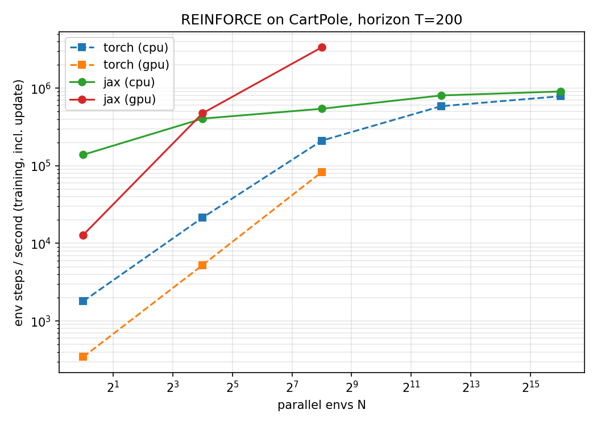

# Differentiable Simulation and Reinforcement Learning with JAX

This repository explores **differentiable simulation of physical systems** and **learning-based control** using **JAX** for high-performance, end-to-end gradient-based optimization. The focus is on pendulum-like dynamical systems as minimal yet representative examples of robotics and control problems.

## Scope

The core idea is to model physical dynamics as **fully differentiable programs**, enabling:

* Gradient-based system analysis and optimization
* Policy learning through **deep reinforcement learning** directly on the simulator
* Efficient acceleration on CPU/GPU via **JAX XLA compilation**

The repository compares and connects:

* Classical physics-based simulation
* Neural-network-based policy learning
* Differentiable simulation + policy gradient methods

## Key Components

* **Differentiable dynamics in JAX**
  Single-DoF and double-DoF pendulum systems implemented using pure JAX, compatible with `jit`, `grad`, and `lax.scan`.

* **Policy Gradient / REINFORCE**
  End-to-end training of stochastic policies where gradients flow through the simulator, demonstrating learning-based control of physical systems.

* **JAX vs PyTorch vs CUDA**
  Side-by-side implementations highlighting trade-offs between:

  * JAX (XLA-compiled, functional, differentiable)
  * PyTorch (imperative, flexible autograd)
  * Custom CUDA kernels (maximum control, lowest-level)

* **Neural control of physical systems**
  Neural networks act as controllers, optimized directly against physical objectives (stabilization, regulation) using deep RL.

## Structure

* `Diff_Sim_JAX.py`, `JAX_Diff_Sim.py`
  Core differentiable simulators in JAX

* `pend_JAX_RL.py`, `pend_JAX_RL.ipynb`
  Reinforcement learning (REINFORCE) with differentiable physics

* `InvPend_JAX.py`
  Inverted pendulum dynamics and control

* `Diff_PG.ipynb`
  Policy gradient experiments and analysis

* `Cuda_Diff_Sim.cpp`
  Low-level CUDA-based differentiable simulation (comparison baseline)

* `Dis_Comp_JAX.py`
  Computational and performance comparisons

* `Accelerated_RL/rl_acc.py`
  JAX vs PyTorch speed benchmark for an RL training loop (see below)

## Benchmark: JAX vs PyTorch for RL

[`src/Accelerated_RL/rl_acc.py`](src/Accelerated_RL/rl_acc.py) trains the same agent on the same task in both frameworks: REINFORCE with an MLP (4→64→64→2) on a batched CartPole that uses the gym dynamics, a 500-step limit and T=200 steps per iteration. Only the execution model differs. PyTorch runs in eager mode with a Python loop over time steps. JAX compiles the whole iteration (rollout via `lax.scan`, returns, gradient and Adam update) into one `jit` function.



Training throughput in env steps/s, including the update (RTX 3090; PyTorch CPU limited to 4 threads):

| Parallel envs N | torch CPU | torch GPU | JAX CPU | JAX GPU |
|---|---|---|---|---|
| 1 | 1.8k | 0.3k | 139k | 13k |
| 16 | 21k | 5k | 405k | 474k |
| 256 | 211k | 83k | 542k | **3.36M** |
| 4096 | 585k | — | 804k | — |
| 65536 | 786k | — | 906k | — |

* JAX is **~40–90× faster than PyTorch on GPU**. Eager PyTorch is limited by kernel-launch and Python overhead, and is even slower on GPU than on CPU for this small model.
* On CPU, JAX leads by ~77× at N=1, and the gap narrows to ~1.2× at large N, where the arithmetic dominates.
* JAX GPU reaches near-max episode length (~493/500) in **6 s**, against 182 s for PyTorch GPU (N=1024).
* The cost is compile time: JAX's first iteration takes ~4–5 s on GPU, against ~1 s for PyTorch.

Caveats: the GPU was shared with another job, so the absolute GPU numbers are pessimistic, and the N≥4096 GPU runs (—) ran out of memory. PyTorch is plain eager mode, without `torch.compile` or CUDA graphs.

```bash
pip install torch "jax[cuda12]" matplotlib
python src/Accelerated_RL/rl_acc.py --backend jax --device gpu --num-envs 1024   # single run
python src/Accelerated_RL/rl_acc.py --sweep --steps-budget 200000                # full grid -> results/
```

## Motivation

Differentiable simulation bridges classical control, robotics, and modern machine learning. By combining **physics priors** with **neural policies** and **automatic differentiation**, the same framework can be used for:

* System identification
* Control learning
* Sensitivity analysis
* Sim-to-real research pipelines

This repository serves as a compact experimental testbed for these ideas, emphasizing clarity, performance, and physical correctness.
